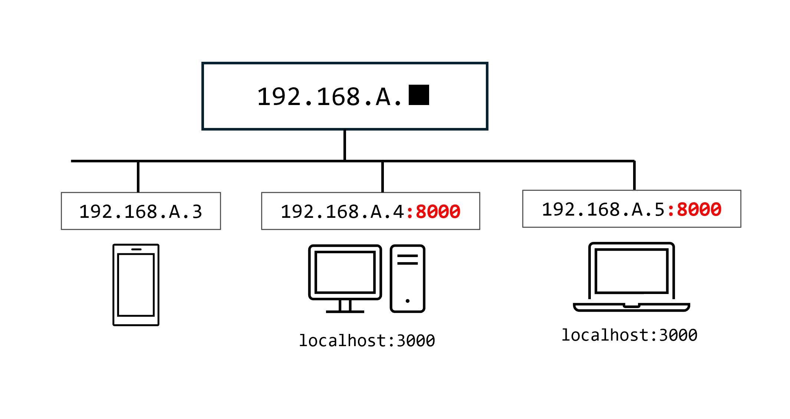
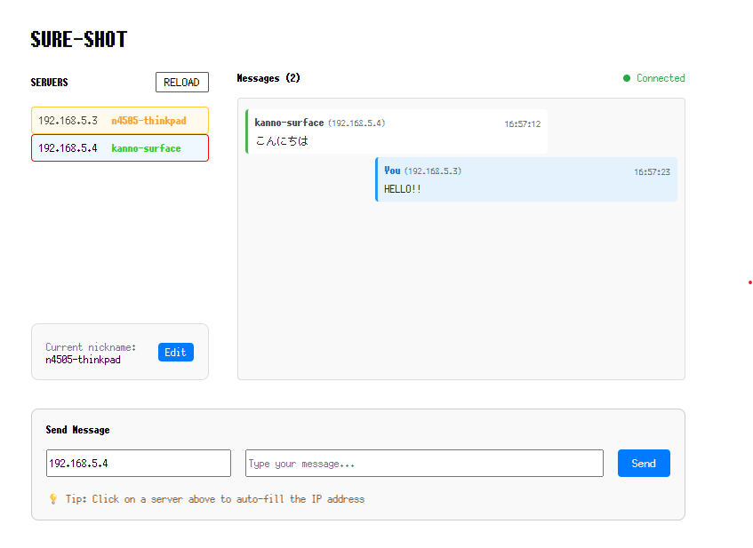

# Sure Shot

A **Local-First** Messaging Application.


## Usage

``` bash
# Start HTTP server (port 8000)
cd ./server
cargo install
cargo run

# Start the frontend
cd ..
# Using pnpm
pnpm dev
# Or using npm
npm run dev
```
Then, open http://localhost:3000 to get started!

## Features

* Transfer text, images, files... any kind of data!
* Works **locally only**
* **Extremely** fast
* Cross-platform

## How it works



## Demo

